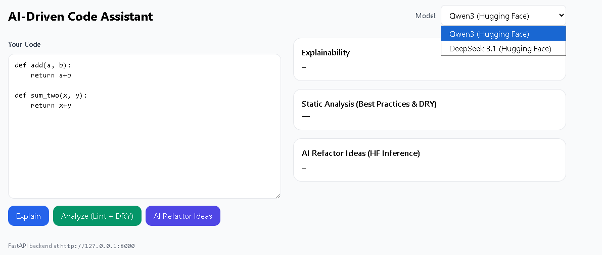
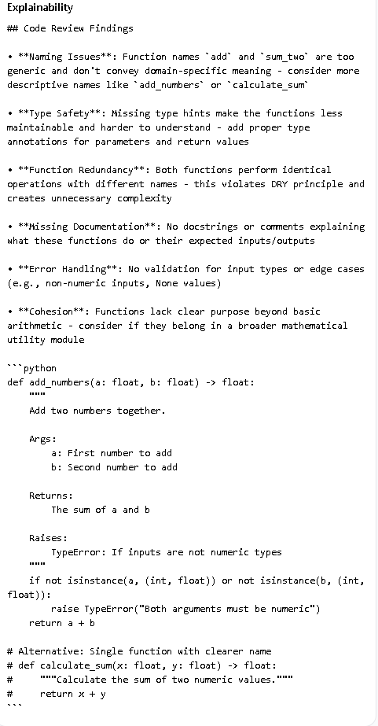
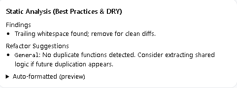
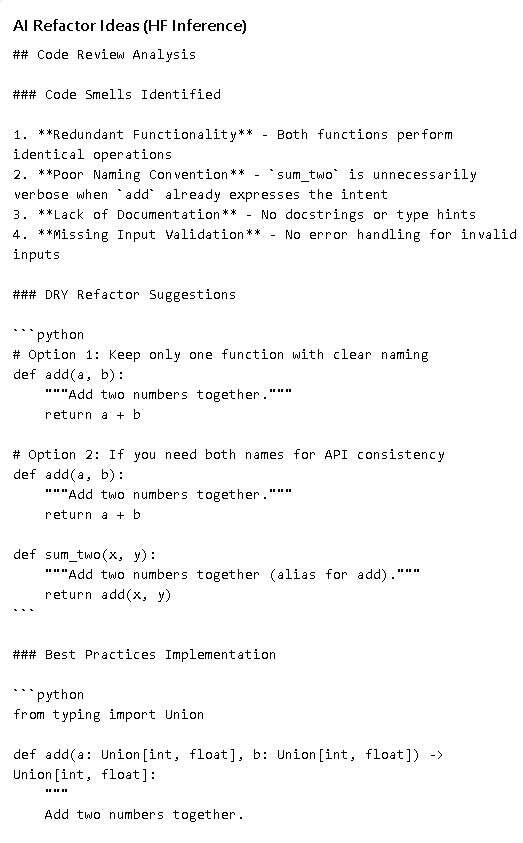

# AI-Driven Code Assistant (code-assistant)

A drop-in, full-stack capstone: **React** frontend + **FastAPI (async)** backend + **Hugging Face Inference** (Qwen3 & DeepSeek 3.1). It delivers model selection, explainability, lint/DRY analysis, and refactor suggestions with caching for snappy UX.

---

## ✨ Features
- **Model Selection:** Toggle between Qwen3 and DeepSeek 3.1.
- **Explainability:** Markdown review + commented code.
- **Best Practices:** Lint-like findings (tabs, prints, bare except, long lines, etc).
- **DRY Detection:** Identical function bodies flagged with refactor hints.
- **Async + Caching:** FastAPI + httpx + simple TTL cache.
- **Modern UI:** Tailwind, loading skeletons, error boundaries.

---

## 🧱 Architecture

```text
[ React UI ] --fetch--> [ FastAPI ] --async httpx--> [ Hugging Face Inference ]
     |                         |                               |
     |                         +-- local static analysis        +-- Qwen3 / DeepSeek 3.1
     +-- model selection       +-- TTL cache (45s)              

## Steps for the backend to start

cd backend
copy .env.example .env
# Edit .env to set:
#   HF_API_TOKEN=hf_xxx
#   QWEN3_MODEL=Qwen/Qwen2.5-Coder-7B-Instruct
#   DEEPSEEK31_MODEL=deepseek-ai/DeepSeek-Coder-V2-Lite-Instruct

py -m venv .venv
.\.venv\Scripts\activate
pip install -U pip
pip install -e .
uvicorn app.main:app --reload --host 127.0.0.1 --port 8000

## Steps for the frontend to start

cd frontend
npm i
npm run dev
# Open http://127.0.0.1:5173

## Production Notes

Frontend: npm run build ⇒ static assets in dist/ (serve via CDN or reverse proxy).

Backend: run behind a production ASGI server (e.g., uvicorn --workers 2), fronted by Nginx; add persistent cache (Redis) if desired.

Add auth (JWT/OAuth) and rate-limiting for multi-user scenarios.


## Steps post building the scaffolding include the code.

cd C:\Users\A708269\Downloads\code-assistant\backend
pip install cachetools


## Screenshots





